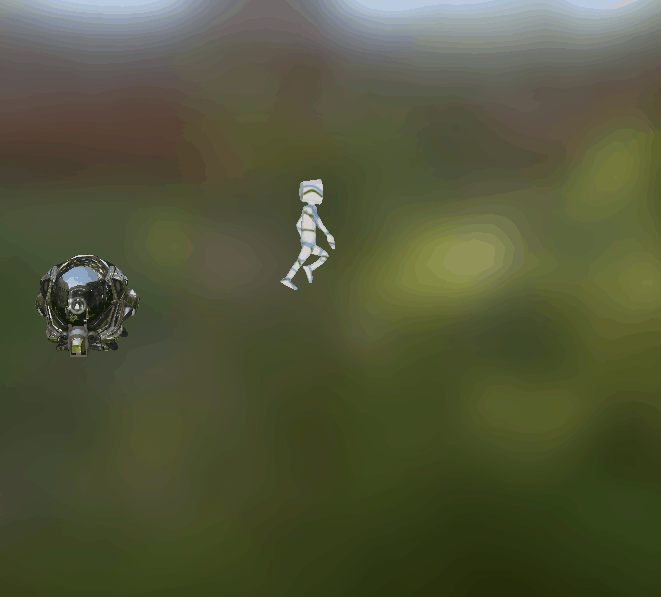
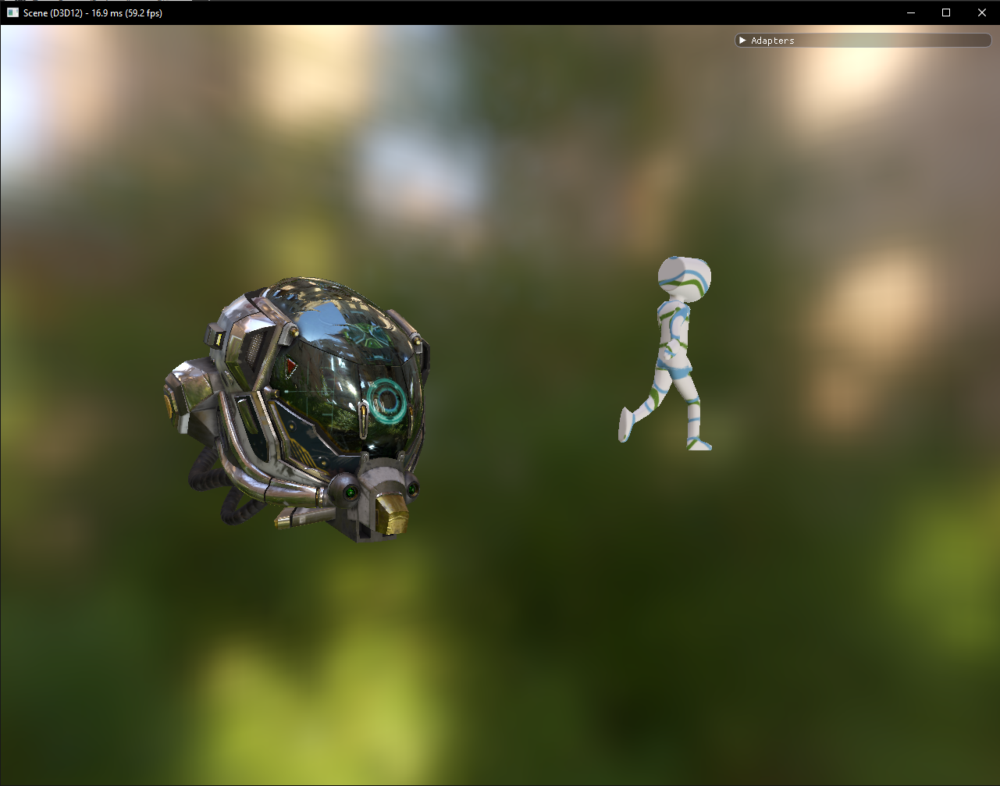

# Importation d'un GLTF Viewer

* Ajout d'une map d'environnement
* Ajout d'une caméra libre

# Result

Result with the camera in front of the actors :

Result with a different camera view point :

# Ajout de la lumière au sein du moteur

L'implémentation se fait en se basant sur le tutoriel n°19 de Diligent.

Les fichiers qui ont été modifié pour l'implément sont :

* Lights.cpp/h
* TestScene.cpp/h
* GLTFLoader.cpp/h
* GLTF_PBR_Renderer.cpp/h
* GLTFObject.cpp/h

Des fichiers n'ont pas encore été touché encore en expérimentation :
* RenderGLTF_PBR.psh (shader de rendu des fichiers GLTF peut être modifier en prennant exemple sur cube.psh shader de rendu des cubes utilisé dans tutoriel19)
